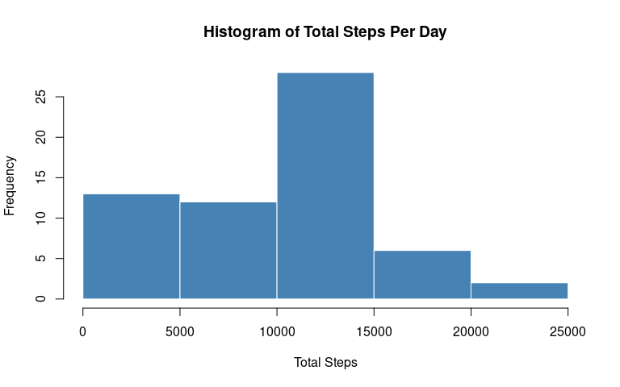
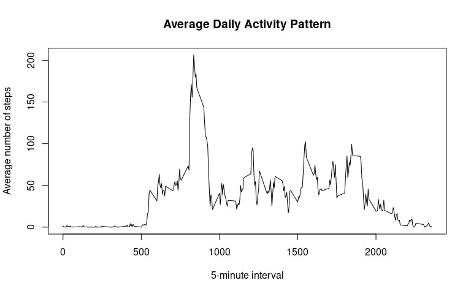
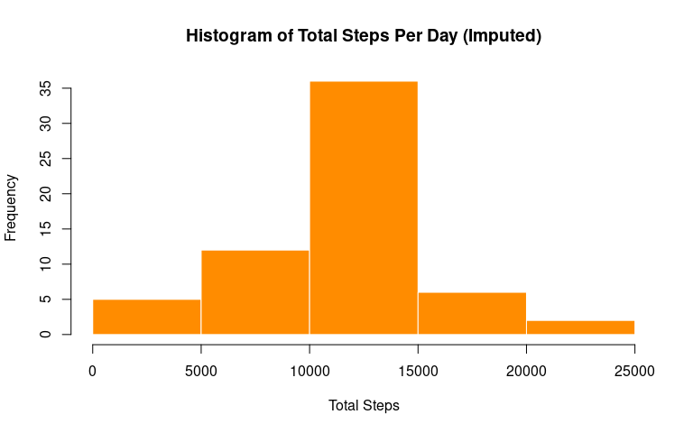
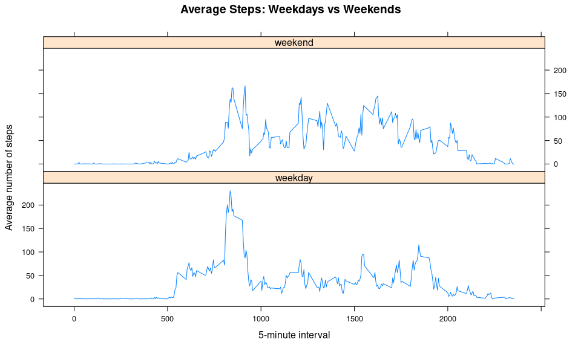

## Loading and preprocessing the data


```r
data <- read.csv("activity.csv")
head(data)
```

```
##   steps       date interval
## 1    NA 2012-10-01        0
## 2    NA 2012-10-01        5
## 3    NA 2012-10-01       10
## 4    NA 2012-10-01       15
## 5    NA 2012-10-01       20
## 6    NA 2012-10-01       25
```

```r
str(data)
```

```
## 'data.frame':	17568 obs. of  3 variables:
##  $ steps   : int  NA NA NA NA NA NA NA NA NA NA ...
##  $ date    : chr  "2012-10-01" "2012-10-01" "2012-10-01" "2012-10-01" ...
##  $ interval: int  0 5 10 15 20 25 30 35 40 45 ...
```

## What is mean total number of steps taken per day?


```r
library(dplyr)
```

```
## 
## Attaching package: 'dplyr'
```

```
## The following objects are masked from 'package:stats':
## 
##     filter, lag
```

```
## The following objects are masked from 'package:base':
## 
##     intersect, setdiff, setequal, union
```

```r
steps_by_day <- data %>%
  group_by(date) %>%
  summarise(total_steps = sum(steps, na.rm = TRUE))
```

```
## `summarise()` ungrouping output (override with `.groups` argument)
```

```r
steps_by_day
```

```
## # A tibble: 61 x 2
##    date       total_steps
##    <chr>            <int>
##  1 2012-10-01           0
##  2 2012-10-02         126
##  3 2012-10-03       11352
##  4 2012-10-04       12116
##  5 2012-10-05       13294
##  6 2012-10-06       15420
##  7 2012-10-07       11015
##  8 2012-10-08           0
##  9 2012-10-09       12811
## 10 2012-10-10        9900
## # … with 51 more rows
```

### Histogram of total steps per day


```r
hist(steps_by_day$total_steps, 
     main = "Histogram of Total Steps Per Day", 
     xlab = "Total Steps", 
     col = "steelblue", 
     border = "white")
```

<!-- -->

### Mean and median steps per day


```r
mean_steps <- mean(steps_by_day$total_steps)
median_steps <- median(steps_by_day$total_steps)
cat("Mean:", mean_steps, "\n")
```

```
## Mean: 9354.23
```

```r
cat("Median:", median_steps, "\n")
```

```
## Median: 10395
```

## What is the average daily activity pattern?


```r
interval_avg <- data %>%
  group_by(interval) %>%
  summarise(avg_steps = mean(steps, na.rm = TRUE))
```

```
## `summarise()` ungrouping output (override with `.groups` argument)
```

```r
plot(interval_avg$interval, interval_avg$avg_steps, 
     type = "l", 
     xlab = "5-minute interval", 
     ylab = "Average number of steps",
     main = "Average Daily Activity Pattern")
```

<!-- -->

### 5-minute interval with maximum steps


```r
max_interval_row <- interval_avg %>%
  filter(avg_steps == max(avg_steps))
max_interval_row
```

```
## # A tibble: 1 x 2
##   interval avg_steps
##      <int>     <dbl>
## 1      835      206.
```

## Imputing missing values


```r
total_missing <- sum(is.na(data$steps))
cat("Total number of missing values:", total_missing, "\n")
```

```
## Total number of missing values: 2304
```

### Imputation strategy: Replace NA with mean steps for that 5-minute interval


```r
interval_mean <- data %>%
  group_by(interval) %>%
  summarise(mean_steps = mean(steps, na.rm = TRUE))
```

```
## `summarise()` ungrouping output (override with `.groups` argument)
```

```r
data_imputed <- data
for (i in 1:nrow(data_imputed)) {
  if (is.na(data_imputed$steps[i])) {
    interval_val <- data_imputed$interval[i]
    mean_val <- interval_mean$mean_steps[interval_mean$interval == interval_val]
    data_imputed$steps[i] <- mean_val
  }
}
```

### Histogram after imputation


```r
steps_by_day_imputed <- data_imputed %>%
  group_by(date) %>%
  summarise(total_steps = sum(steps))
```

```
## `summarise()` ungrouping output (override with `.groups` argument)
```

```r
hist(steps_by_day_imputed$total_steps, 
     main = "Histogram of Total Steps Per Day (Imputed)", 
     xlab = "Total Steps", 
     col = "darkorange", 
     border = "white")
```

<!-- -->

### Mean and median after imputation


```r
mean_imputed <- mean(steps_by_day_imputed$total_steps)
median_imputed <- median(steps_by_day_imputed$total_steps)
cat("Mean (imputed):", mean_imputed, "\n")
```

```
## Mean (imputed): 10766.19
```

```r
cat("Median (imputed):", median_imputed, "\n")
```

```
## Median (imputed): 10766.19
```

```r
cat("Mean (original):", mean_steps, "\n")
```

```
## Mean (original): 9354.23
```

```r
cat("Median (original):", median_steps, "\n")
```

```
## Median (original): 10395
```

## Are there differences in activity patterns between weekdays and weekends?


```r
data_imputed$date <- as.Date(data_imputed$date)
data_imputed$daytype <- weekdays(data_imputed$date)
data_imputed$daytype <- factor(ifelse(data_imputed$daytype %in% c("Saturday", "Sunday"), "weekend", "weekday"))
```


```r
library(lattice)
interval_daytype <- data_imputed %>%
  group_by(interval, daytype) %>%
  summarise(avg_steps = mean(steps))
```

```
## `summarise()` regrouping output by 'interval' (override with `.groups` argument)
```

```r
xyplot(avg_steps ~ interval | daytype, data = interval_daytype,
       type = "l", layout = c(1, 2),
       xlab = "5-minute interval",
       ylab = "Average number of steps",
       main = "Average Steps: Weekdays vs Weekends")
```

<!-- -->
